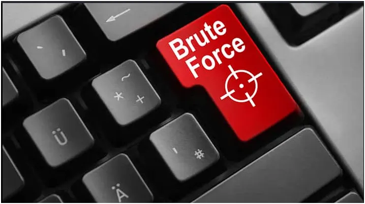

SSH -> Secure shell is used to establish remote connection between to two endpoints (client-server or client to client) over the network. Native to all operating systems.

FTP -> File Transfer Protocol, this is a file sharing protocol that allows devices(clients and server) share files and resources across the network efficiently.
_network abuse is the unauthorized or malicious use of these legitimate network services to access, transfer, modify, or misuse data or systems over a network._

Brute Force (T1110)

A brute-force attack is a trial-and-error method where an attacker repeatedly tries many different username and password combinations until they eventually find the correct one and gain access to a system or service such as an FTP or SSH server. There are two major sub-techniques under it that people tend to confuse with each other:

    Password spraying(T1110.003): Attempting one or a small handful of very commonly used passwords e.g the current year, a common word plus a digit, a well-known defaults names or terms against a large number of different usernames, deliberately spread out in time to avoid triggering per-account lockout threshold.
    Credential stuffing(T1110.004): Taking username-and-password pairs already leaked from some unrelated previous data breach, and testing them against a different service, on the assumption that plenty people reuse the same password across multiple sites.

SSH

SSH are designed from the onset to be secured and protected but there a few part left visible by that same design,

An SSH connection begins with a version exchange immediately after the TCP handshake completes, both the client and server sends a single line of plain text identifying their software and protocol version in the format of SSH-protocol version and Softwareversion. ( investigator’s tell: checking the communicated software and protocol version to see if it matches a known device on the network.

Immediately following the banner exchange both sides exchange a Key Exchange Init message (KEXINIT) also in clear text, it contains the key change Algorithm Encryption Cipers, MAC Algorithm and compression message.

A practical abuse example; a TCP connection that open and exchanges a small consistent volume of encryptied traffic with corresponding banner and one failed auth attempt then closes — typically within a second or two in real time mostly carrying a striking consistent total byte counts across many such connection from the same source, same tool signature(Softwareversion) same fixed sequence and packet sizes are all great tells of an anormally on a network and possibly and active brute force.

A legitimate interactive session looks different in these, it persists far longer ( minutes or hours) with higher inregular byte counts, suggesting a human is behind there.

even without decrypting any packet we can have sights to what going on with the protocol.

Wireshark detect and filter:
tcp.port == 22 && tcp.flag.syn ==1 && tcp.flag.ack == 0 -> ssh connection attempts
Get OxSEEKER’s stories in your inbox

Brute Force Tool:

    Hydra — produces a burst of overlapping short-lived connection attempts instead of a suquential manner.
    Medusa — same as Hydra
    N-crack_ produces a finer control over timing and connection rate mimicking a human behaviour

FTP

It’s control channel operating on TCP port 21 entirely unencrypted by default i.e every command between the client and server is directly readable by anyone observing the traffic.
Auth;

An FTP login proceeds as a simple, plain text command and response exchange. The client sends a USER followed by a username and the server responds with 331 code if the username is available. The client then sends PASS followed by the password itself in plain text and the server server responds with either code 230 — successful or 530 — failed

Note: every single one of these exchanges are plain text

Wireshark:

FTP.request.command == “USER” -> every username attempted
FTP.request.command == “PASS” ->every password attempted
FTP.response.code == 530 -> failed logon
FTP.response.code == 230 -> Successful logon
DETECTION METHODOLOGY

    Establish a baseline before declaring an anormaly
    Frequency count
    Timing regularity
    Source and Destination addresses

That would all for today. Till next time ciao
