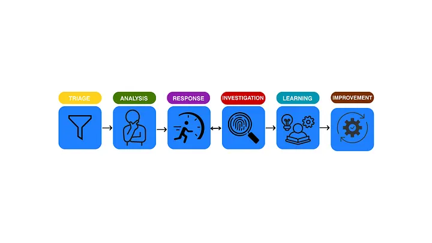

---
title: "Digital Forensics : The obscured security practice"
date: 2026-09-20
draft: false
tags: ["Digital forensics"]
summary: "understanding the blured lines of forensics."
---

“You work in forensics right?, then you must be working with the police or feds” I get this a lot whenever I’m being asked about my chosen niche — and it sucks. The constant association with its sister, Forensics science, has distorted the way we all see it — they are very different.

Cyber Security is the practice of protecting systems, networks, and data from digital attacks, unauthorized access, or damage. It involves implementing technologies, processes, and policies to defend against cyber threats and ensure the confidentiality, integrity, and availability of information assets. Behind every secured organisation is a layered pipeline of specialised roles, each doing work the others cannot fully absorb. Digital forensics is one of them, and arguably the most misunderstood.

Why Digital Forensics and Not Just Incident Response?
Why do we need Digital forensics if Incident Response can just take up the work or split it between the SOC and threat hunting team? I mean that would make a lot of sense with lesser personnel and faster remediation; most SOC managers would approve that plan immediately. But that creates an endless reactive loop of attack and defence. Incidents are just contained, lightly investigated and root causes inferred rather than proven and in the process key factors could be missed.

“Yes sure, SOC teams too can investigate endpoints and find entry points but that is not what they are built for”.

Away from the popular belief that Digital forensics is only tied to law enforcement, although that’s its tagline –proving that something happened, and when, Digital forensics is a significant pillar in securing organisational infrastructure.It reconstructs the order of events, builds an incident timeline, and answers what really happened, how it happened, and the full extent of the damage. To understand why that matters, we need to look at how enterprise security actually operates.

The Enterprise Security Pipeline
A fully structured enterprise security operation does not run on instinct, it runs on a deliberate pipeline:

Triage → Analysis → Response ↔ Investigation → Learning → Remediation → Improvement

Each stage has a defined role, a defined output, and a team responsible for it. Skip or overload any one stage and the entire pipeline might degrade. Here is how each layer works.

Triage:
Triage is the first line of defence, typically handled by SOC (Security Operations Centre) Level 1 analysts. Their job is to monitor incoming security alerts, filter out noise, and escalate what matters. Tools like SIEM (Security Information and Event Management) and EDR (Endpoint Detection and Response) generate enormous volumes of alerts daily — the Level 1 analyst’s job is to give those alerts some context and cut the workload for senior analysts (SOC L2 and L3).

The goal here is not deep investigation. It’s rapid assessment. Without effective triage, everything above it drowns in noise.

Analysis
Analysis is not a single step but a continuous process that evolves in depth; comprising two layers.

The first layer, Initial Analysis, is a shared responsibility between SOC Level 1 and Level 2 analysts. After triage sorts the alerts, analysts work to make sense of what happened — for example, a SIEM flags a suspicious process and the analyst must decide: real threat or false positive? At this stage, it is easy to miss out on malicious processes or attack chains due to the logs volumes and how impractical it is to carry out deeper search.

The second layer, Deep Analysis, takes a more granular approach. Senior analysts feed off what the initial layer uncovered, read meaning into it, and assess whether the threat can be contained at this level or needs to be escalated to Incident Response for containment. Analysis is a very crucial stage of any security stack and skipping the multiple analysis chain makes it easier to miss hidden threats lurking deeper in the networks

Response
When the SOC escalates, the Incident Response (IR) team moves in to contain the threat and restore business continuity.They pick up where the SOC left off e.g. isolating compromised systems, segmenting networks, deploying countermeasures with the primary goal of stopping any further active damage. At this stage, preliminary investigation begins: how far did the damage spread, which systems are compromised, what containment measures are appropriate? But this is not yet full forensic depth. It prepares the ground for later phases where detailed root cause analysis and attacker behavior reconstruction are carried out. There should be a proper incident response playbook to avoid improvisation in turn compounding the negative business impact.

Investigation
This is where Digital Forensics earns its place.

Investigation is the process of constructing a precise order of events, building an incident timeline that answers the questions Incident Response could only estimate i.e how did the attack happen? What tools did the attacker use? Where was the point of entry? What was compromised? Who got in, and how long were they in before anyone noticed?

During investigation, an IR team might conclude: “Ransomware entered via phishing.” A forensic investigation of the same incident might prove: “A specific employee was phished and their credentials were harvested three weeks prior through a free giveaway portal, giving the attacker persistent access long before the ransomware was deployed.” Those are not the same findings. One is more detailed and contextual while the other just estimates, without the forensics insight, the attacker might still hold a strong persistence using the stolen credentials and could Lie in wait.

Learning and Remediation
Combining all learnt throughout the incident cycle, starting from the triage down to investigation. Proper documentation from the security teams after an event containment can be transformed into playbooks and learnt from — they know what to look for next time, how to respond faster, what the attacker’s behaviour pattern looked like .Simultaneously, all compromised systems and networks are restored to their proper state.
This stage is what breaks the endless loop of attack and defend , they should be taken very importantly

Improvement
Once systems are restored, security engineers use the findings to harden the overall security posture i.e patching gaps, updating detection logic, revising controls based on what the attacker actually exploited. This is the stage that makes the pipeline self-improving rather than just self-repairing.

The Free role: Threat Hunting and Intel Gathering
This is a free role that feeds directly to all layers of security ensuring that they are up to date of the threat surface. This is where threat hunting comes in, intel gathering is very useful to every stage of security even including forensics. Intelligence gathered are used in every stage of the security;

Triage teams receive updated TTPs (Tactics, Techniques and Procedures) to sharpen alert filtering. SOC analysts get better detection and mitigation techniques. IR teams learn more effective containment approaches. Forensics and engineering teams update their security stack based on emerging attacker behaviour. This layer completes the cycle of learning and keeps the entire pipeline from going stale between incidents.

Policy and Compliance
The entire security stack isn’t complete without talking about the presiding role that enforces policy and ensures full security compliance in the organisation.They handle risk management, security stack selection, auditing, stakeholder briefing, and policy enforcement across the organisation.They are the function that ensures every other team operates within defined boundaries and can account for their actions when it matters. Formally they are called the GRC (Governance, Risk and Compliance) team

Forensics and GRC( Governance, Risk and Compliance)
GRC and Digital forensics intersect at the point where evidence interpretation is needed for business accountability. GRC basically deal with; what happened, what was affected, and whether regulatory or policy thresholds were breached and how they would be interpreted to stakeholders which is where digital forensics comes in, Through it’s investigation it can answer these questions and fill up the information gap needed for a GRC personnel to create a tangible report.

Take example; An employee violated a company policy, forensics is used to investigate and validate that then the GRC team writes a report and carry out appropriate judgement So normally GRC feeds directly into the forensics investigative findings while GRC frameworks, often guided by standards such as NIST, influence how forensic investigations are conducted by enforcing requirements around logging, evidence handling, and documentation. Rather than being compared, they basically work hand in hand to ensure policy and compliance are being earnestly followed.

The Case for Forensics
Back to the original question: why digital forensics, when incident response and SOC already exist?

The answer is simple, “Forensics exists for a different reason entirely”. Every other function in the pipeline reacts, contains, and moves on. Forensics is the one that stays, asks the deeper questions and answers with proof rather than inference

If an organisation wants to truly understand the how, why, what and when of an incident — not just containment and quick remediation, digital forensics is not optional.

For us professionals and enthusiasts trying to find our relevance in the private sector, Digital Forensics is a core security pillar of many organisation and it would stay this way for a very long time.Although a lot of times there aren’t really clear paths to being a digital forensics practitioner except through the thick bushes of SOC.The role is also frequently outsourced, many organisations bring forensics in only during major incidents rather than maintaining it in-house which makes the field feel invisible until it is urgently needed.

Overall, It’s just bad PR!
