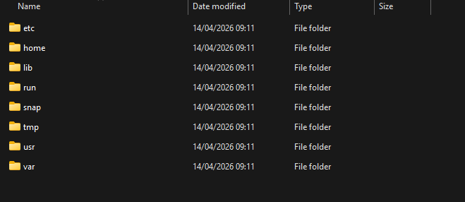
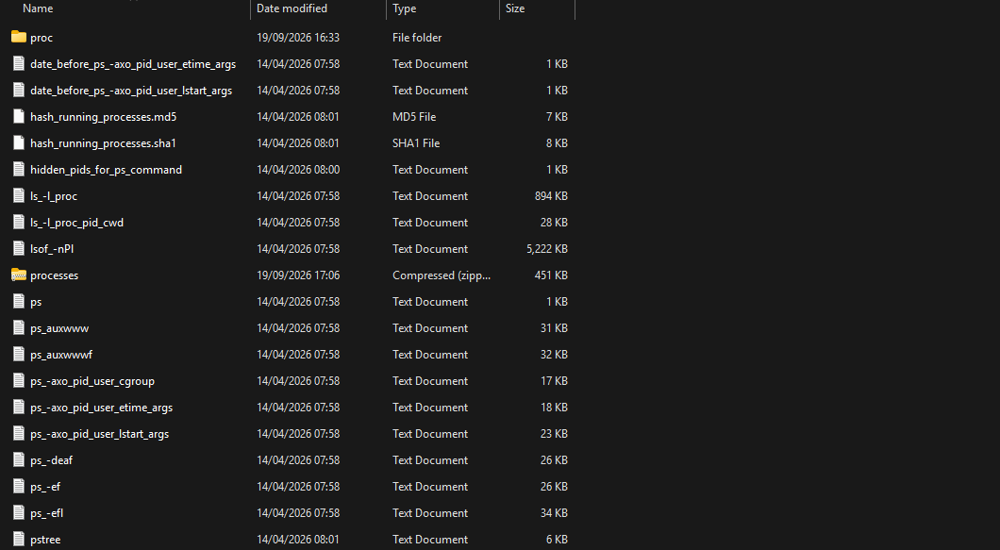

**UAC (Unix-like Artifacts Collector)** is a powerful and extensible incident response tool designed for forensic investigators, security analysts, and IT professionals. It automates the collection of artifacts from a wide range of Unix-like systems, including AIX, ESXi, FreeBSD, Linux, macOS, NetBSD, NetScaler, OpenBSD and Solaris.. It is very customizable and extensible.

Process for collection:
- It checks for avaiabble system tools eg shells, tar, gz, netcat etc
- Loads the configuration file which is a yaml file that contains a list of customizable commands to be used
- Build the list of artifact to be collected per the config file 
- Loads the collectors
- Stores the collected file as _output.tar.gz_ pair with an acquisition log of the process

### Collectors
These are used to actually collect the artifact from the system, there are different types :
1. Command: This is used to run commands on the triage system stored and configured on the configuration file and the outputs are stored as text files
2. Find: This is used to find specific types of files to be collected  and also the output are stored in text file
3. Stat: This is used to collect file system metadata during the triage using that stat command 
4. File: This is used too collect raw files specified in the config file from the triage system

### Output
- Acquisition log: Contains the basic information about the entire acquisition eg system information, triage start and end time, output file hash, Mount point and hostname
- **[root]**: this contains File collected by the _file collector_, This file are collected in raw format and placed in their original path. This can be loaded into any forensics tool of your choice 
- Bodyfile: This is collected by the _stat collector_, This contains all the files collected during the triage metadata 
- Hash executables: This contains the hash of every file collected or touched by UAC
- Live responses: This contains the output of every command ran by the _command collector_ and every response stored as text file. the response may contain command list ps list, ps aux, netstat etc based on the triage configurations.
- System: This contains artifacts collected by the _find collector_, it contains the output of every searched string done for the triage.

### Unique Features

- **Zero-install, zero-dependency**: UAC does not need to be installed on the target system — download the latest release, uncompress it, and launch. It's meant to run from a USB stick or network share so you don't touch the evidence disk more than necessary. 
- **Order of volatility**: It respects the order of volatility and artifacts that are changed during the execution, a core forensic principle (grab RAM/processes before disk, disk before logs that rotate, etc.). 
- **YAML-driven extensibility**: every artifact and every profile is a YAML file, so anyone can write their own collectors without touching the core script.
- **Broad reach beyond "normal" servers**: UAC is designed for diverse environments, including IoT devices and NAS systems, and even runs on OpenWrt-style network gear
-  Collect information about current running processes (including processes without a binary on disk).
- Hash running processes and executable files.
- Extract files and directories status to create a bodyfile.
- Collect system and user-specific data, configuration files, and logs.
- Acquire volatile memory from Linux systems using different methods and tools.
- Support to write output to various cloud platforms eg FTP server or s3 storage bucket.

### What it can actually collects

Grouped by artifact category in the repo:

- **Process data** — running processes (including processes with no binary left on disk), hashed executables, hashed running processes, strings from process memory
- **Bodyfile generation** — file/directory status metadata for timeline building
- **System & config data** — logs, cron/systemd/init persistence locations, package manager state (apt/yum/dpkg/brew/pip/npm/cargo/etc. — dozens of package managers across OSes)
- **Network state** — netstat/ss/lsof-style connection info, firewall rules
- **Browser artifacts** — Chrome, Firefox, Safari, Brave, Edge, Opera, Vivaldi history/cookies/cache
- **Communication apps** — Signal, Telegram, WhatsApp, Slack, Discord, iMessage/Messages, Teams, Skype, Viber
- **Containers/VMs** — Docker, Podman, LXC, Proxmox (qm/pct), jails, zones
- **Memory acquisition** — Linux memory dumps via Microsoft's `avml` tool
- **Rootkit indicators** — hidden `/etc/ld.so.preload`, kernel taint state, eBPF hooks, immutable files, SUID/SGID/world-writable file lists
- **AI coding tool artifacts (new in v3.4.0, Sept 2026)** — this is a genuinely interesting angle for an article. UAC added collection of session data, config, and credentials from Claude Code, Claude Desktop, Cursor, GitHub Copilot CLI, OpenAI Codex CLI, Gemini CLI, Amp, Cursor, Goose, Kiro, and about a dozen other AI dev tools — chat history, shell snapshots, memory files, hook scripts, credential stores. It's the first major DFIR collector to formally treat AI coding assistants as a forensic artifact class, which is a strong hook for a piece.

UAC is an incredible lightweight and opensource tool for Linux forensics acquisition,It brings together volatile information, filesystem metadata, configuration files, logs, application artifacts, network state, persistence indicators and increasingly specialised artifacts into a structured acquisition package.The resulting data can be moved into dedicated forensic and DFIR tools for timeline analysis, malware investigation, correlation and deeper examination. 

It literally makes collection and analysis easier for the investigator  

Also worth noting that UAC is a live forensic collector not a static imager so it might add changes to a forenscis image while running it ctriage
